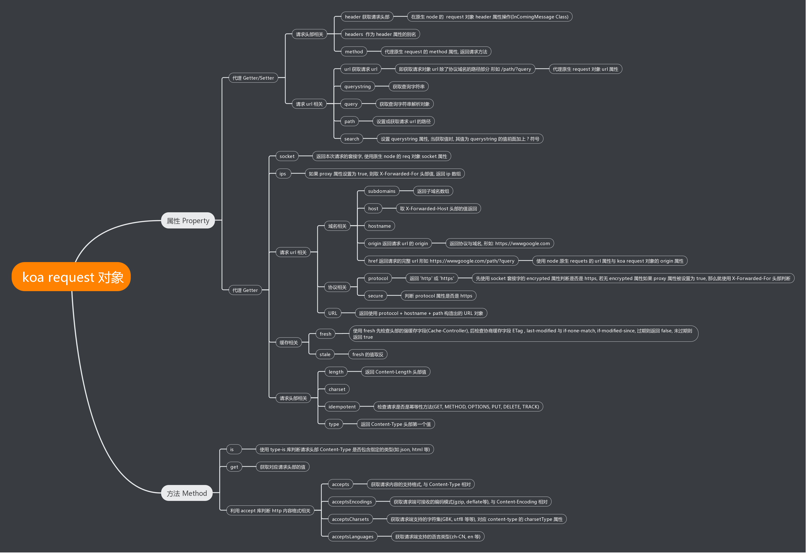
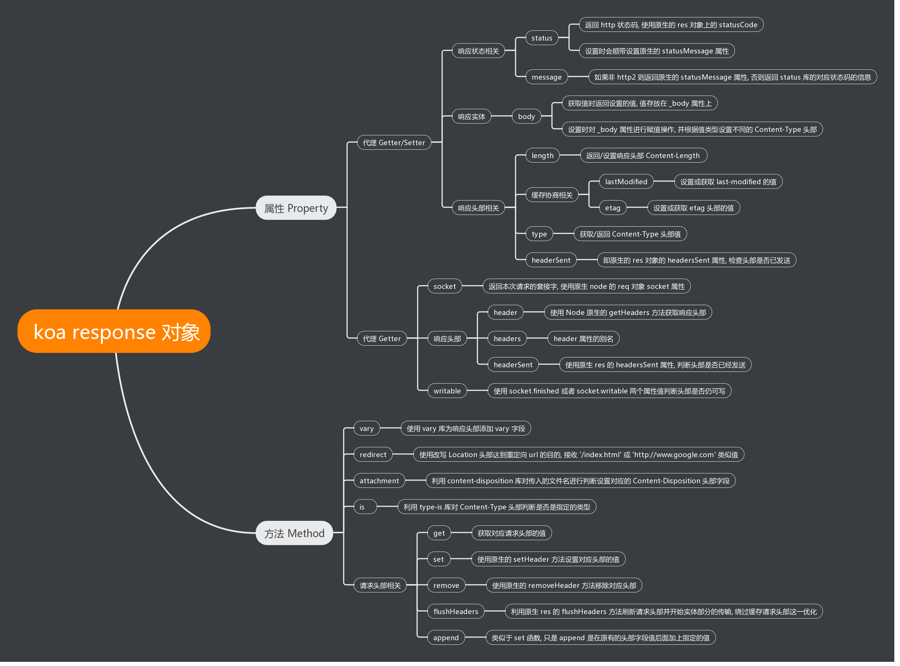

# Koa_study

## Koa简介

Koa 是一个新的 web 框架，由 Express 幕后的原班人马打造， 致力于成为 web 应用和 API 开发领域中的一个更小、更富有表现力、更健壮的基石。 通过利用 async 函数，Koa 帮你丢弃回调函数，并有力地增强错误处理。 Koa 并没有捆绑任何中间件， 而是提供了一套优雅的方法，帮助您快速而愉快地编写服务端应用程序

- 基于Node.js：Node.js模块
- 下一代：蚕食第一代Web框架Express的市场
- web 框架
- 更小、更富有表现力、更健壮
- 利用async函数，丢弃回调函数
- 增强错误处理：try catch
- 没有捆绑任何中间件

## 应用服务对象

能够提供接收，解析，响应，中间件。http流程全链路，这些服务能力的综合体。可以看成一个应用服务对象。

## Koa核心对象

- ```Application```：Web服务对象。接收，解析，响应http请求。
- ```Context```：执行上下文。http请求周期内的作用域环境，托管请求，响应和中间件，方便它们之间互相访问。
- ```Request```：请求对象。是在 node 的 vanilla 请求对象之上的抽象，提供了诸多对 HTTP 服务器开发有用的功能。
- ```Response```：响应对象。是在 node 的 vanilla 响应对象之上的抽象，提供了诸多对 HTTP 服务器开发有用的功能。
- ```Middlewares```：中间件。在解析请求，响应请求中间存在第三方中间件，来增强Koa的服务能力。
  - koa的中间件机制是一个剥洋葱式的模型，多个中间件通过use放进一个数组队。列然后从外层开始执行，遇到next后进入队列中的下一个中间件，所有中间件执行完后开始回帧，执行队列中之前中间件中未执行的代码部分，这就是剥洋葱模型，koa的中间件机制
- 错误捕获和错误处理
  - ```中间件的错误处理捕获```：通过洋葱模型执行中间件，处理请求，中间件执行过程中会使用try catch捕获异常，错误。如果存在异常，错误。直接返回一个状态为rejected的promise对象。外层通过使用promise的catch方法，就可以把所有的中间件的异常全部捕获到，实现了中间件的错误异常捕获。如果不存在异常，会返回一个状态为resolved的promise对象。外层通过使用promise的then方法，处理最终的结果，向请求对象响应数据。
  - ```框架层面的错误处理捕获```：通过继承```Emitter```自定义事件 可以订阅错误事件实现框架层的错误捕获机制

## Koa源码分析

- [application.js](./koa/lib/application.js)
- [context.js](./koa/lib/context.js)：context 的核心就是通过 delegates 这一个库, 将 request, response 对象上的属性方法代理到 context 对象上
- [request.js](./koa/lib/request.js)：主要是对原生的 http 模块的 request 对象进行封装, 其实就是对 request 对象某些属性或方法通过重写 getter/setter 函数进行代理
  
- [response.js](./koa/lib/response.js)：主要是对原生的 http 模块的 response 对象进行封装, 其实就是对 response 对象某些属性或方法通过重写 getter/setter 函数进行代理
  
- [koa-compose](./koa-compose/index.js)：将 koa各个中间件合并执行，结合 next() 就形成了洋葱式模型


## 参考

- [koa 源码解析](https://www.jianshu.com/p/3e0f4077d3e4)